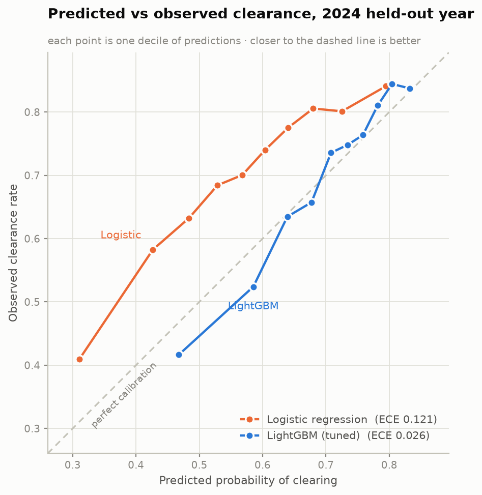
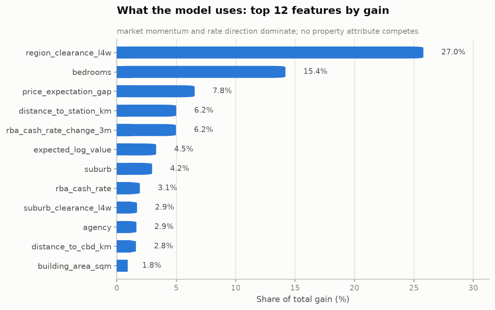

# Melbourne Auction Clearance Predictor

[](https://github.com/Kanav-Midha/melbourne-auction-clearance/actions/workflows/ci.yml)
[](https://www.python.org/downloads/)
[](LICENSE)

Predicts the probability that a Melbourne residential property **sells under the
hammer** on a given Saturday, from property attributes, spatial features (CBD and
PTV train proximity), trailing suburb/region clearance rates, the RBA cash rate,
and BOM weather.

Served as a FastAPI endpoint that returns a calibrated probability plus the
drivers behind it.

```bash
git clone https://github.com/Kanav-Midha/melbourne-auction-clearance.git
cd melbourne-auction-clearance
make setup && make all      # build data, audit, train, test (~4 min)
make api                    # http://127.0.0.1:8000/docs
```

---

## The business problem

Roughly 1,000–1,500 Melbourne properties go to auction on a busy Saturday, and
about a third pass in. A pass-in is expensive for everyone: the vendor's campaign
budget is spent, the property carries a "passed in" stigma into private
negotiation, and the agency has burned four weeks of an agent's time.

The decision this model supports is the **price guide conversation**, which
happens two to four weeks before auction day. An agent who can say *"at $1.45m
this clears with ~78% probability; at $1.65m it drops to ~52%"* is having a
different conversation than one relying on instinct.

Three things follow from that framing, and they drive every modelling choice
below:

1. **The output must be a calibrated probability, not a ranking.** "70%" has to
   mean 70%, because a human repeats it to a vendor. Discrimination (AUC) is
   secondary to calibration (Brier, ECE).
2. **Only pre-auction information is admissible.** Anything known only after the
   hammer falls is unusable, however predictive.
3. **Evaluation must be chronological.** The market regime changes; a random
   split trains on 2024 and tests on 2020.

<picture>
  <source media="(prefers-color-scheme: dark)" srcset="reports/figures/clearance_timeline_dark.png">
  
</picture>

The 2022 collapse is the whole modelling problem in one picture: clearance fell
from the mid-70s to under 50% as the cash rate went from 0.1% to 3.1%, and any
model trained without that regime in view will be confidently wrong about it.

---

## Results

Trained on 2019–2022, validated on 2023, tested on the **2024 calendar year** —
a full year after the training window closes, which is the real deployment gap.
The test split is touched exactly once.

| Model | ROC-AUC | PR-AUC | Brier | ECE | Lift @ top decile |
|---|---|---|---|---|---|
| Logistic regression (baseline) | 0.659 | 0.795 | 0.211 | 0.121 | 1.21× |
| **LightGBM (tuned)** | **0.673** | **0.804** | **0.193** | **0.026** | 1.20× |
| *Oracle ceiling* | *0.756* | — | — | — | — |

Base rate on the test split is 69.7%.

**Read this honestly.** An AUC of 0.673 is not an impressive-sounding number, and
it should not be. Auction outcomes are driven substantially by things no dataset
contains — how the property presents on the day, who happens to turn up, whether
two buyers become emotional in the same ten minutes. The *oracle ceiling* row is
the AUC achievable by a model with access to the true latent probability of every
auction; at 0.756 it bounds what any model could reach here. The tuned model
recovers **68% of the achievable signal** against the baseline's 62%.

The gain that actually matters is calibration: **ECE improves 4.7×** (0.121 →
0.026). The baseline's probabilities are systematically wrong by ~12 percentage
points, which makes them useless in the vendor conversation the model exists to
support. Predicted vs observed on the 2024 test split:

| Decile | Predicted | Observed | Gap |
|---|---|---|---|
| 1 (lowest) | 0.468 | 0.416 | −0.051 |
| 5 | 0.708 | 0.736 | +0.028 |
| 10 (highest) | 0.832 | 0.837 | +0.005 |

Full table: [`reports/calibration_test.csv`](reports/calibration_test.csv).

<picture>
  <source media="(prefers-color-scheme: dark)" srcset="reports/figures/calibration_dark.png">
  
</picture>

### What the model uses

| Feature | Gain |
|---|---|
| `region_clearance_l4w` — trailing 4-week region clearance | 27.0% |
| `bedrooms` | 15.4% |
| `price_expectation_gap` — guide vs expected value | 7.8% |
| `distance_to_station_km` | 6.2% |
| `rba_cash_rate_change_3m` | 6.2% |
| `expected_log_value` | 4.5% |
| `suburb` | 4.2% |

<picture>
  <source media="(prefers-color-scheme: dark)" srcset="reports/figures/feature_importance_dark.png">
  
</picture>

Market momentum and interest-rate direction dominate — which matches how the
Melbourne market actually behaves. The 2022 tightening cycle took clearance from
76% to 57% in under a year, and no property attribute competes with that.

---

## How it was built

This repository keeps its history rather than presenting a clean final state,
because the mistakes are the interesting part. The commit log runs through four
stages.

### Stage 1 — one notebook, and a model that was too good

[`notebooks/01_initial_exploration.ipynb`](notebooks/01_initial_exploration.ipynb)

Hardcoded paths, EDA, a random forest on every numeric column. **AUC 1.0000.**

`sold_price` is populated if and only if the property sold. Median-imputing the
nulls did not remove that signal, it just moved it: every unsold property got the
same value, so the model learned "price == $863,000 means it didn't sell". I was
predicting the sale price to predict whether there was a sale.

Dropping the five post-sale columns took it to **0.629**.

### Stage 2 — refactor, then find the leak that survived

[`notebooks/02_leakage_investigation.ipynb`](notebooks/02_leakage_investigation.ipynb)

Loading and cleaning moved into [`src/data/`](src/data/) so every cell saw the
same frame. Along the way that surfaced 720 duplicated `listing_id`s (double-
entered results) which had been splitting across train and test, and 297 suburb
spellings for 100 real suburbs.

Then the interesting one. Trailing suburb clearance is an obvious, legitimate
feature — last month's results are public. Adding it took AUC from 0.644 to
**0.775**, which is far too large a jump for one aggregate.

```python
g[["sold", "held"]].rolling("28D").sum()                   # includes today
g[["sold", "held"]].rolling("28D", closed="left").sum()     # correct
```

`rolling` includes the right edge of the window, so the 28-day window for
15 October **contains 15 October**. Every property was being told the result of
its own auction day, including its own result. Nothing about the broken version
looks wrong — no nulls, plausible rates, a real business rationale.

Fixed: **0.649**. The feature is still worth keeping; it just is not magic.

Also found here: a random split on six years of time series was worth **+0.055
AUC** of pure optimism over a chronological one.

**The leak is now a test, and the first version of that test did not work.**
[`check_temporal_integrity`](src/features/leakage_audit.py) originally rebuilt
features on a truncated history and required the past to be unchanged — which
cannot detect a window reaching only as far as the current day, because that
window never touches the removed region. It passed cleanly on the exact bug it
was written for. The working version scrambles every outcome from a cutoff date
onward and requires rows on or before that date to be bit-identical:

```
$ python -m src.features.leakage_audit
[FAIL] temporal  suburb_clearance_l4w  81/25011 rows on or before 2022-06-04
                                       change when outcomes from 2022-06-04
                                       onward are scrambled (max delta 1)
```

Those 81 rows are the auctions held on the cutoff date itself.
[`tests/test_leakage.py`](tests/test_leakage.py) monkeypatches the bug back in
and asserts the audit catches it, so the check cannot rot into a no-op.

### Stage 3 — a model that works, and the feature that made it work

[`src/models/`](src/models/)

The first tuned LightGBM tied the linear baseline (0.664 vs 0.657) and overfit
badly — 0.746 train against 0.629 validation, with `suburb` taking 30% of total
gain. It had memorised location rather than learned anything.

Two fixes:

**Narrow the search space.** Up to 192 leaves at depth 10 on 30k rows is enough
capacity to memorise. Constrained to 8–64 leaves, depth 3–8, and a
`min_child_samples` floor of 40. `suburb` gain fell from 30% to 4%.

**Give the trees a ratio they cannot construct.** The overpricing feature was

```python
guide_vs_suburb_median = guide_price_midpoint / suburb_median_price_l90d
```

which has a standalone AUC of **0.43** — worse than chance, because it is
confounded. A four-bedroom house guided at $1.6m in a suburb with a $900k median
is not overpriced, it is a bigger house. The feature measured "expensive property
in a cheap suburb".

The fix is to divide by what the property is actually worth:

```python
price_expectation_gap = log(guide_midpoint) - log(E[value | attributes])
```

A gradient-boosted tree splits on thresholds; it cannot divide one input by a
learned function of ten others. So the division has to happen in feature
engineering. [`src/features/price_model.py`](src/features/price_model.py) fits a
separate LightGBM regressor on log sale price, using **training-window sales
only**, with **out-of-fold** estimates for training rows so a property's own sale
price never helps score it.

That feature is now the third most important in the model, and it is what an
agent can actually act on.

### Stage 4 — serving

[`src/api/`](src/api/)

The non-obvious problem: most features describe the *market*, not the property. A
caller asking "will 12 Smith St clear?" knows the bedrooms. It does not know
Northcote's trailing clearance rate, and should not have to — if every consumer
computed it themselves, the online features would drift from the offline ones.

So the service owns them. [`src/api/context.py`](src/api/context.py) snapshots
every contextual feature and ships it next to the model; the value model travels
in the same bundle so `price_expectation_gap` is reproduced identically online.

```bash
curl -X POST http://127.0.0.1:8000/predict -H 'Content-Type: application/json' -d '{
  "suburb": "Northcote", "auction_date": "2025-03-15", "property_type": "h",
  "bedrooms": 3, "bathrooms": 1, "car_spaces": 1,
  "land_size_sqm": 372, "building_area_sqm": 128, "year_built": 1925,
  "guide_price_low": 1480000, "guide_price_high": 1620000
}'
```

```json
{
  "clearance_probability": 0.7585,
  "predicted_outcome": "likely_sell",
  "confidence_band": "high",
  "drivers": {
    "suburb_clearance_l4w": 0.8,
    "region_clearance_l4w": 0.6531,
    "guide_vs_expected_value_pct": -5.3445,
    "expected_value": 1638000.0,
    "rba_cash_rate": 4.35,
    "auctions_scheduled_that_day": 205.0
  },
  "context_as_of": "2024-12-28",
  "model_version": "lgbm-1.0.0",
  "warnings": []
}
```

| Endpoint | Purpose |
|---|---|
| `POST /predict` | Score one property |
| `POST /predict/batch` | Score a campaign (≤500), with a summary |
| `GET /health` | Liveness + readiness; degrades rather than crash-loops |
| `GET /model/info` | Deployed version, training window, held-out metrics |
| `GET /suburbs` | Coverage |

Unknown suburbs return **422, not a guess** — a plausible-looking wrong number is
worse than an error.

---

## The data

⚠️ **The raw extracts in this repository are synthetic.** REIV/Domain auction
results and the BOM historical archive are not redistributable in bulk, so
[`src/data/make_dataset.py`](src/data/make_dataset.py) generates files with the
same schema *and the same defects* as the real ones:

- prices as `"$1,250,000"` mixed with bare integers
- price guides as free text (`"$900,000 - $990,000"`)
- 297 suburb spellings for 100 suburbs
- 720 double-entered result rows
- BOM rainfall as text with quality flags, 7.7% missing
- **a three-month Olympic Park station outage in winter 2021** — which matters,
  because it is the nearest station to most inner-suburb auctions, so a naive
  nearest-station join silently drops rows that are not missing at random

The generative process reproduces the real market's behaviour: the actual RBA
cash rate path, the 2020 lockdown auction bans, spring/autumn volume peaks, and
the 2022 tightening cycle. Simulated clearance by year — 71%, 72%, 76%, 57%, 59%,
67% — tracks the published REIV series.

Because the process is known, `data/interim/ground_truth.parquet` holds each
auction's true latent probability, which is where the **oracle ceiling of 0.756**
comes from. Real data never affords that luxury; it is the main analytical
advantage of working with a simulator.

To swap in licensed extracts, replace the three files in `data/raw/`. Nothing
downstream changes.

**Sources the real pipeline targets:** REIV/Domain weekly auction results · BOM
Climate Data Online (stations 086338, 086282, 086038, 087031, 086104) · PTV GTFS
feed · RBA F1.1 cash rate · ABS SA2 boundaries.

---

## Layout

```
src/
├── config.py                 paths, splits, feature lists, LEAKY_COLUMNS
├── data/
│   ├── make_dataset.py       synthetic raw extracts (documented defects)
│   ├── data_loader.py        parsing, dedup, suburb normalisation, target
│   ├── weather.py            BOM gap-filling + nearest-station join
│   └── suburbs.py            suburb reference table
├── features/
│   ├── spatial.py            haversine, CBD + PTV proximity (vectorised)
│   ├── preprocess.py         causal trailing windows, calendar, macro
│   ├── price_model.py        expected-value model -> overpricing gap
│   └── leakage_audit.py      null-pattern + permutation temporal checks
├── models/
│   ├── dataset.py            split assembly, pinned category levels
│   ├── baseline.py           logistic regression reference
│   ├── tune.py               Optuna search (PR-AUC, no K-fold)
│   ├── train.py              two-stage fit, refit on train+valid
│   └── evaluate.py           calibration, ECE, lift, segment metrics
└── api/
    ├── main.py               FastAPI app
    ├── schemas.py            Pydantic contracts
    ├── context.py            market-context snapshot
    └── features.py           online feature assembly
```

`make audit` is a CI gate over `config.FEATURES`; it exits non-zero on any
finding, and [`.github/workflows/ci.yml`](.github/workflows/ci.yml) runs it on
every push alongside `ruff` and the test suite on Python 3.11 and 3.12. A second
job builds the Docker image and smoke-tests `/health` and `/predict` against the
running container, so the deployment path is verified rather than asserted.

`python -m src.features.leakage_audit --scan-raw` is the discovery mode that
scans every column, including the post-sale ones the raw extract legitimately
contains.

---

## Things I would do next

- **Backtest week by week** rather than on one held-out year, to see how fast the
  trailing features go stale and set a real retraining cadence.
- **Model pass-in reserve gaps.** `PI` and `VB` are currently one class, but
  "passed in $10k short" and "passed in $300k short" are different outcomes.
- **Replace suburb centroids with real geocoding.** Distances are currently
  computed from the centroid, which understates within-suburb variation —
  meaningful in large outer suburbs.
- **Fix the value model's selection bias.** It is fit only on properties that
  sold, which biases expected value upward. Median suburb sale prices from the
  Victorian Valuer-General would give an unselected anchor.
- **Monitor feature drift in production.** The context snapshot is the thing most
  likely to silently go stale.

---

## Running it

```bash
make setup      # dependencies
make data       # generate raw extracts
make audit      # leakage gate over the feature set; exits 1 on any finding
make baseline   # logistic regression reference
make tune       # Optuna search (~3 min, 60 trials)
make train      # fit + save model, context and metrics
make figures    # regenerate the README figures (light + dark)
make lint       # ruff
make test       # 83 tests
make api        # serve on :8000
make docker     # multi-stage build; trains in builder, ships a slim runtime
```

Requires Python 3.10+. Licensed under the [MIT License](LICENSE).
